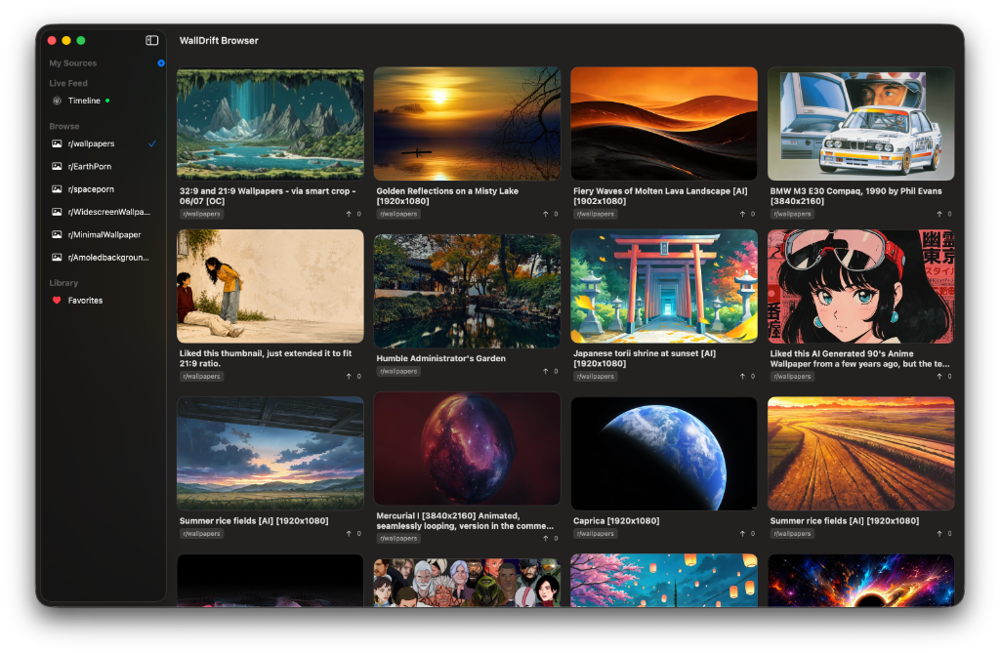
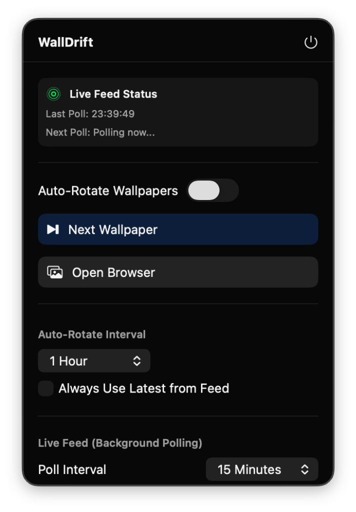

# WallDrift

WallDrift is a simple, native macOS utility that keeps your desktop background fresh by cycling through high-quality wallpapers from Reddit. It fetches images from subreddits like r/wallpapers, r/EarthPorn, or any custom subreddit you add.

The app runs in your menu bar to stay out of the way, but you can open the main window to browse, download, or favorite specific images.

<p align="center">
  
  
</p>

## Download & Install

You don't need to compile anything from source. Just download the app directly:

1. Head over to the [Releases](https://github.com/subwaycookiecrunch/Walldrift/releases/latest) page.
2. Download the `WallDrift.dmg` file.
3. Open the disk image and drag the app into your Applications folder.

*(Note: Since this app isn't signed with an Apple Developer account, macOS might block it the first time you open it. To bypass this, right-click the app in your Applications folder and select "Open" from the menu).*

## Features

- **Auto-rotate wallpapers:** Set a time interval to cycle through Reddit posts on all your connected screens.
- **Menu bar control:** Skip wallpapers, clear the cache, or open settings directly from the status bar icon.
- **Custom subreddits:** Add any image-heavy subreddits you like.
- **Native performance:** Built in Swift and SwiftUI, so it runs light on memory and CPU.
- **Smart caching:** Automatically caches images locally to save bandwidth, keeping the cache size under 500MB.

## Building from source

If you want to build the project yourself, I used [XcodeGen](https://github.com/yonaskolb/XcodeGen) so you don't have to deal with messy `.xcodeproj` merge conflicts.

1. Install XcodeGen if you don't have it:
   ```bash
   brew install xcodegen
   ```
2. Generate the Xcode project:
   ```bash
   xcodegen generate
   ```
3. Open `WallDrift.xcodeproj` and run it in Xcode.

## Under the hood

It runs on macOS 13.0+ using Swift 5.9, SwiftUI, and AppKit. Wallpapers are saved locally in your user library at `~/Library/Application Support/WallDrift`.

Feel free to fork the repository or submit issues if you run into anything!
